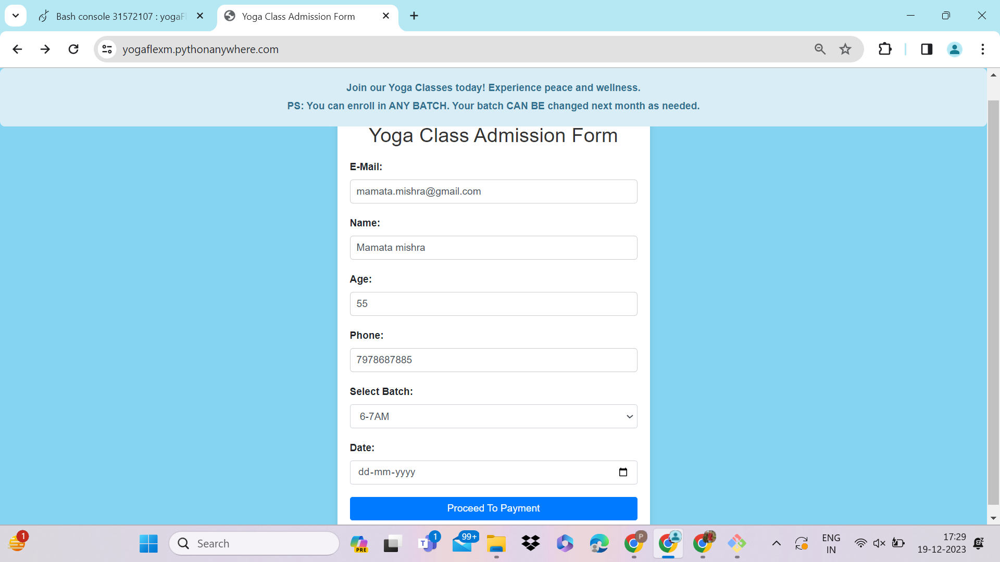
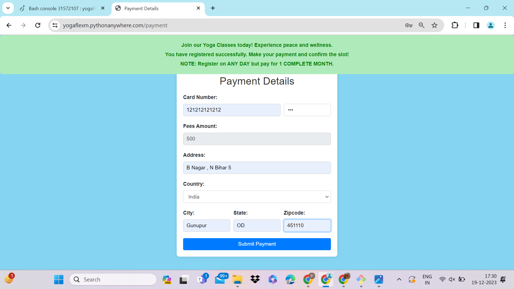
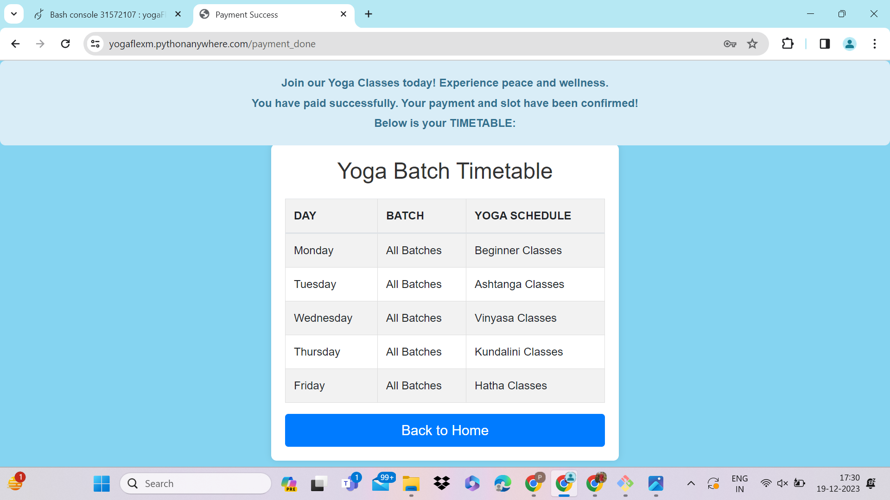
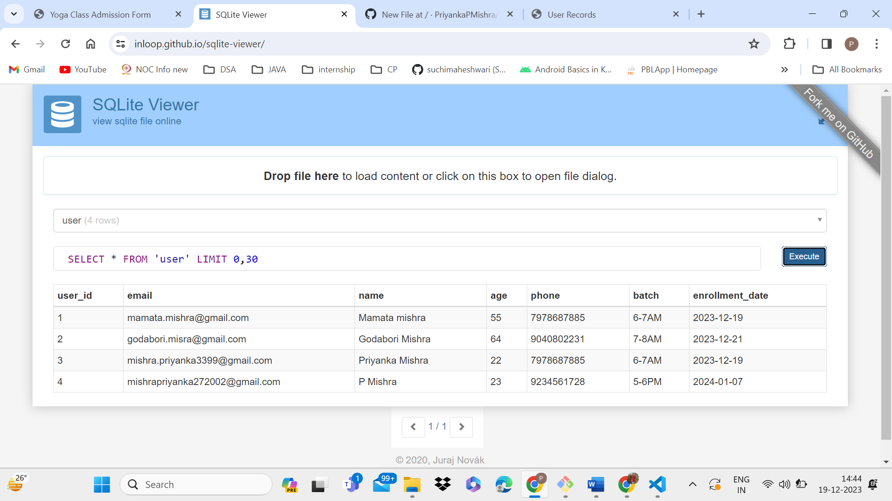
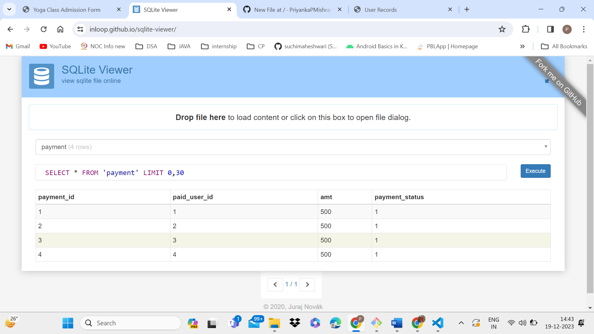
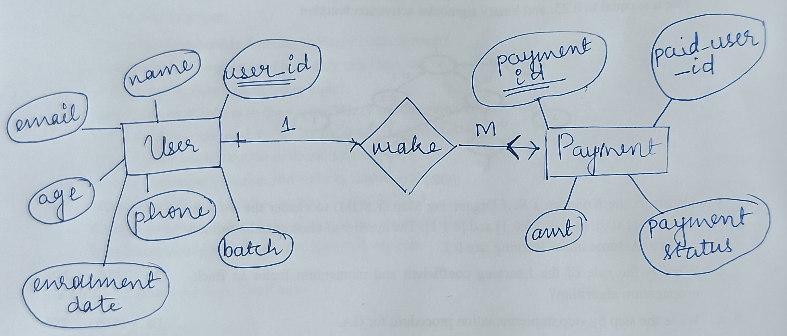
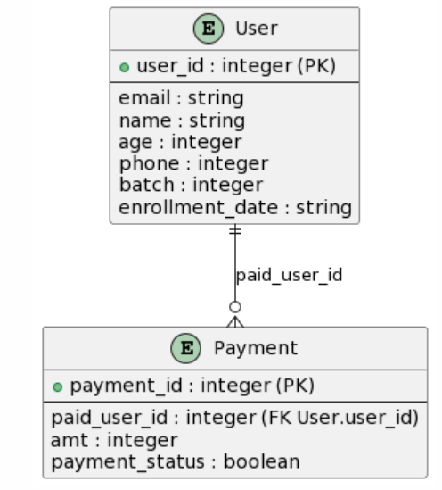

## REQUIREMENTS:

I have built the web application using the following tech stack:
- FRONTEND: HTML, CSS, JS(for validation), Bootstrap
- BACKEND: Flask
- DATABASE: Flask-SQLAlchemy

The workflow is as follows:
- User fills out the form.
- Data is saved into the database.
- User is redirected to the Payment Page.
- User fills the required details.
- On successful payment (mock payment functionality), User is redirected to the Confirmation page.

Functionalities:
- Enrollment form for the user.
   
  Fields:
    - E-Mail (Which should be unique, i.e. two users cannot have the same email)
    - Name
    - Phone Number
    - Age
    - Choice of options for Batch
    - Date of Enrollment (If not selected, the default date is set to today, i.e., the date of registration of a user)
  
- (Mock) Payment method for the user.
   
  Fields:
    - Card Number
    - CVV (Maximum of 3 characters and Cannot be viewed, i.e., hidden as an input field)
    - Fees Amount (500/- fixed for a month)
    - Address details
 
- Payment Confirmation Page:
   
  Fields:
    - Shows the Timetable for the user and the yoga schedule of a week.

Assumptions:
- None of the payment method is real.
- Card Credentials are not being stored to the database.
- TimeTable shown at the payment confirmation page does not hold any resemblance to real-life yoga classes.

## SAMPLE OUTPUTS:

- ENROLLMENT FORM:

 

- PAYMENT FORM:

 

- CONFIRMATION FORM:

 

- USER DATABASE:

 

- PAYMENT DATABASE:

- ER DIAGRAM (HAND DRAWN):

- ER DIAGRAM (ONLINE DRAWN):
  

## DEPLOYMENT:

- Deployed on PythonAnywhere.
- URL: https://yogaflexm.pythonanywhere.com
- NOTE: MAKE SURE TO ADD A NEW EMAIL, SO AS TO AVOID ERROR. (THE APP IS IN INITIAL STATE DUE TO TIME-CONSTRAINT)

## PERSONAL NOTE:

Even though the task requirement was preferably ReactJS for frontend, I chose HTML-CSS-JS-BootStrao because:
- I focused on though-process and problem solving!
- Learning ReactJS was a bit difficult for me, given my basic skills on JS. (Honesty is the best policy! 😉 )
- Cuz, SIMPLICITY IS THE ULTIMATE SOPHISTICATION! 😊
